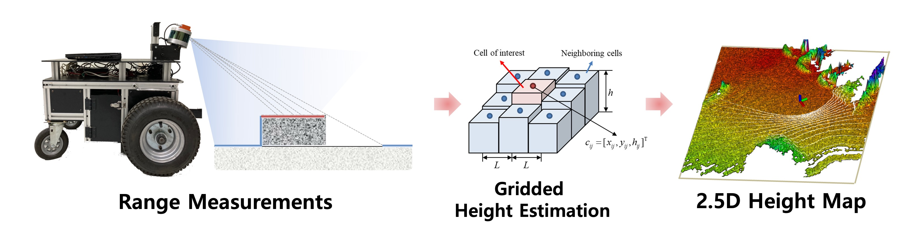
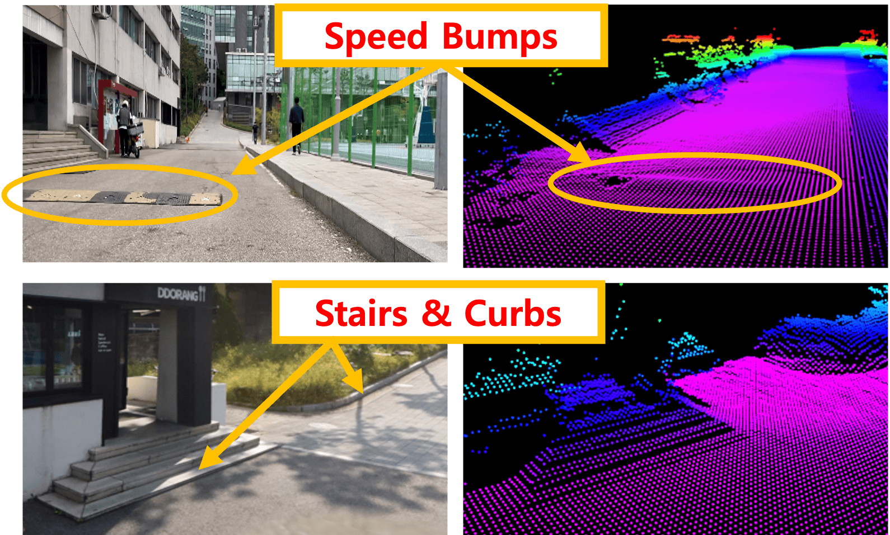

# Height Mapping
A robust [ROS](https://www.ros.org/) package for real-time 2.5D terrain mapping, optimized for autonomous mobile robots operating in outdoor environments. 
The package generates dense terrain maps with high efficiency that enables critical navigation capabilities including:

- Terrain traversability analysis
- Obstacle detection and avoidance 
- Rough terrain path planning
- Real-time environment modeling

This is a research code, expect that it changes often and any fitness for a particular purpose is disclaimed.

## Features
**Overview**: The package is tailored for ground mobile robots, equipped with 
- **Range sensors** (e.g. structured light (Kinect, RealSense), LiDAR, stereo camera) 
- **3D pose estimator** (e.g. with 3D Visual / LiDAR Odometry or SLAM system). 
<p align='center'>
    
</p>
<p align='center'>
    
    
</p>


**Features**:
- **Efficient 2.5D Mapping**

    : with 2.5D gridded representation, the package efficiently maps complex 3D terrain geometry while balancing detail with computational load. 
    The structure is particularly well-suited for real-time robotic applications, enabling fast updates and adjustments as the robot navigates.

- **Multiple Height Estimation Methods**

    : the package offers several height estimation methods, including `Statistical Mean Filter`, `Kalman Filter`, and `Moving Average Filter`. 
    This allows the package to adapt to various mapping needs and environmental conditions.

- **Multi-Sensor Fusion**

    : the package integrates data from multiple range sensors (e.g., LiDAR, structured light sensors like Kinect and RealSense, and stereo cameras). 
    This fusion results in a more accurate and dense representation of the surrounding terrain with larger field-of-view.

- **Global Mapping**

    : the package aggregates local height maps into an extended global map, providing a basis for long-range planning and navigation.


## Installation
**Dependencies:** This software is built on the Robotic Operating System ([ROS](https://www.ros.org/)), successfully tested on
- Ubuntu 20.04 
- ROS Noetic
- PCL (Point cloud library)
- [grid_map](https://github.com/anybotics/grid_map)

For the installation of **`grid_map`**, use the following commands:
```
sudo apt install ros-noetic-grid-map
sudo apt install ros-noetic-grid-map-visualization
```

**Build:** In order to build `height_mapping` package, clone the latest version from this repository and compile the package from source.

```
cd ~/{your-ros-workspace}/src
git clone https://github.com/Ikhyeon-Cho/height_mapping.git
cd ../
catkin build height_mapping
```
> **Note:** For the best performance, complie with the option `-DCMAKE_BUILD_TYPE=release`. It makes significant improvements.

## Basic Usage
1. Configure the parameters in `height_mapping_ros/config/params.yaml`
2. Run the following command to start height mapping:
  ```
  roslaunch height_mapping run.launch
  ```

## Related Projects
To see the real-world application of this project, please refer to:

*['Learning Self-supervised Traversability with Navigation Experiences of Mobile Robots: A Risk-aware Self-training Approach'](https://github.com/Ikhyeon-Cho/urban-terrain-dataset) (IEEE Robotics and Automation Letters, [paper](https://ieeexplore.ieee.org/document/10468651) accepted in Feb., 2024).*
```bibtex
@article{cho2024learning,
  title={Learning Self-Supervised Traversability With Navigation Experiences of Mobile Robots: A Risk-Aware Self-Training Approach}, 
  author={Cho, Ikhyeon and Chung, Woojin},
  journal={IEEE Robotics and Automation Letters}, 
  year={2024},
  volume={9},
  number={5},
  pages={4122-4129},
  doi={10.1109/LRA.2024.3376148}
}
```

## Nodes

### sensor_processor
The `sensor_processor` node do some sensor input pre-processing for height mapping. The pre-procssing step includes:
- Downsampling of point clouds
- Range-based Filtering of point clouds
- Transformation of point clouds to the robot frame
- Merging multiple sensor inputs

#### Subscribed Topics
- **`/sensor1/points`** ([sensor_msgs/PointCloud2](https://docs.ros.org/en/melodic/api/sensor_msgs/html/msg/PointCloud2.html)) <br>
    Raw range measurements from sensor 1 (Both LiDAR and RGB-D are supported). To configure the name and the type of the measurements, set the corresponding parameters in `config/params.yaml`.

- **`/sensor2/points`** ([sensor_msgs/PointCloud2](https://docs.ros.org/en/melodic/api/sensor_msgs/html/msg/PointCloud2.html)) <br>
    Raw range measurements from sensor 2 (Both LiDAR and RGB-D are supported).

- **`/sensor3/points`** ([sensor_msgs/PointCloud2](https://docs.ros.org/en/melodic/api/sensor_msgs/html/msg/PointCloud2.html)) <br>
    Raw range measurements from sensor 3 (Both LiDAR and RGB-D are supported).

- **`/tf`** ([tf2_msgs/TFMessage](https://docs.ros.org/en/jade/api/tf2_msgs/html/msg/TFMessage.html)) <br>
    Transforms from tf tree. The sensor inputs will be transformed to the robot frame (typically, base_link).

#### Published Topics
- **`/height_mapping/sensor/laser/points`** ([sensor_msgs/PointCloud2](https://docs.ros.org/en/melodic/api/sensor_msgs/html/msg/PointCloud2.html)) <br>
    If LiDAR sensor is used as an input, then the preprocessed pointcloud is published with this name. The messages are fed into the `height_mapping` node for terrain mapping.

- **`/height_mapping/sensor/color/points`** ([sensor_msgs/PointCloud2](https://docs.ros.org/en/melodic/api/sensor_msgs/html/msg/PointCloud2.html)) <br>
    If RGB-D sensor is used as an input, then the preprocessed pointcloud is published with this name. The messages are fed into the `height_mapping` node for terrain mapping.

#### Parameters
- **`sensor_processor/pointType`** (string, default: "laser" ) <br>
    The type of range sensors to be used. Choose from ["laser", "color"].

- **`sensor_processor/inputCloudTopic1`** (string, default: "/sensor1/points") <br>
    You can configure the topic name of the input measurement streams here. Currently, maximum three sensor inputs are supported.

- **`sensor_processor/inputCloudTopic2`** (string, default: "/sensor2/points") <br>
    You can configure the topic name of the input measurement streams here.

- **`sensor_processor/inputCloudTopic3`** (string, default: "/sensor3/points") <br>
    You can configure the topic name of the input measurement streams here.

- **`sensor_processor/downsamplingResolution`** (double, default: 0.0) <br>
    The downsampling resolution of the pointcloud. If set to 0.0, then the processor skips the downsampling. Unit: [m/voxel]

- **`sensor_processor/minRangeThreshold`** (double, default: 0.3) <br>
    The minimum range of the measurements from the robot. The points less than the range will be removed and not used for height mapping. Unit: [m]

- **`sensor_processor/maxRangeThreshold`** (double, default: 10.0) <br>
    The maximum range of the measurements from the robot. The points over the range will be removed and not used for height mapping. Unit: [m]

- **`sensor_processor/cloudPublishRate`** (double, default: 15.0) <br>
    The publish rate of the processed pointclouds that will be fed into the mapping process.

<br>

### height_mapping
The `height_mapping` node that locally maps the surrounding terrains in a robot-centric perspective.

#### Subscribed Topics
- **`/height_mapping/sensor/laser/points`** ([sensor_msgs/PointCloud2](https://docs.ros.org/en/melodic/api/sensor_msgs/html/msg/PointCloud2.html)) <br>
    The pre-processed LiDAR sensor input from `sensor_processor` node.

- **`/height_mapping/sensor/color/points`** ([sensor_msgs/PointCloud2](https://docs.ros.org/en/melodic/api/sensor_msgs/html/msg/PointCloud2.html)) <br>
    The pre-processed RGB-D sensor input from `sensor_processor` node.

#### Published Topics
- **`/height_mapping/map/gridmap`** ([grid_map_msgs/GridMap](https://docs.ros.org/en/kinetic/api/grid_map_msgs/html/msg/GridMap.html)) <br>
    The estimated height map.

#### Parameters
- **`frame_id/map`** (string, default: "map" ) <br>
    The frame id of the height map is coincide with the map frame.

- **`height_mapping/heightEstimatorType`** (string, default: "StatMean" ) <br>
    The height estimation methods. Choose from [**`"StatMean"`**, **`"KalmanFilter"`**, **`"MovingAverage"`**].

- **`height_mapping/gridResolution`** (double, default: 0.1 ) <br>
    The grid resolution of the height map. Unit: [m/grid]

- **`height_mapping/mapLengthX`** (double, default: 10.0 ) <br>
    The Length of height map in the x-axis of the map frame. Unit: [m]

- **`height_mapping/mapLengthY`** (double, default: 10.0 ) <br>
    The Length of height map in the y-axis of the map frame. Unit: [m]

- **`height_mapping/minHeightThreshold`** (double, default: -0.5 ) <br>
    This parameter defines the minimum height below the ground surface that will be considered in the map. Any height below this threshold will be disregarded. Unit: [m]

- **`height_mapping/maxHeightThreshold`** (double, default: 1.5 ) <br>
    This parameter defines the maximum height above the ground surface that will be considered in the map. Any height above this threshold (ex. overhanging obstacles) will be disregarded. Unit: [m]

- **`height_mapping/poseUpdateRate`** (double, default: 15.0 ) <br>
    The pose update rate. Height map will follow the robot poses as it is updated. The pose is updated from tf tree. Unit: [Hz]

- **`height_mapping/mapPublishRate`** (double, default: 15.0 ) <br>
    The height map publish rate. Unit: [Hz]

<br>

### map_visualization
The `map_visualization` node that publishes the several height map-related messages, like map regions or height map in pointclouds formats.

#### Subscribed Topics
- **`/height_mapping/map/gridmap`** ([grid_map_msgs/GridMap](https://docs.ros.org/en/kinetic/api/grid_map_msgs/html/msg/GridMap.html)) <br>
    The estimated height map.

#### Published Topics
- **`/height_mapping/map/pointcloud`** ([sensor_msgs/PointCloud2](https://docs.ros.org/en/melodic/api/sensor_msgs/html/msg/PointCloud2.html)) <br>
    The estimated height map in point cloud types.

- **`/height_mapping/map/region`** ([visualization_msgs/Marker](https://docs.ros.org/en/noetic/api/visualization_msgs/html/msg/Marker.html)) <br>
    The boundary of the height map.

<br>

### global_mapping
The `global_mapping` node subscribes the local height map (in pointcloud) from the `height_mapping` node, and publishes the map in a much large (global) scale.

#### Subscribed Topics
- **`/height_mapping/map/pointcloud`** ([sensor_msgs/PointCloud2](https://docs.ros.org/en/melodic/api/sensor_msgs/html/msg/PointCloud2.html)) <br>
    The estimated height map in point cloud types.

#### Published Topics
- **`/height_mapping/globalmap/pointcloud`** ([sensor_msgs/PointCloud2](https://docs.ros.org/en/melodic/api/sensor_msgs/html/msg/PointCloud2.html)) <br>
    The estimated global height map in point cloud types.

- **`/height_mapping/globalmap/region`** ([visualization_msgs/Marker](https://docs.ros.org/en/noetic/api/visualization_msgs/html/msg/Marker.html)) <br>
    The boundary of the global height map.

#### Parameters
- **`global_mapping/gridResolution`** (double, default: 0.1 ) <br>
    The grid resolution of the global height map. Unit: [m/grid]

- **`global_mapping/mapLengthX`** (double, default: 400.0 ) <br>
    The Length of global height map in the x-axis of the map frame. Unit: [m]

- **`global_mapping/mapLengthY`** (double, default: 400.0 ) <br>
    The Length of global height map in the y-axis of the map frame. Unit: [m]

- **`global_mapping/mapPublishRate`** (double, default: 10.0 ) <br>
    The global height map publish rate. Unit: [Hz]

- **`global_mapping/mapSaveDir`** (string, default: "{HOME}/Downloads" ) <br>
    The folder path to save global map in image.

